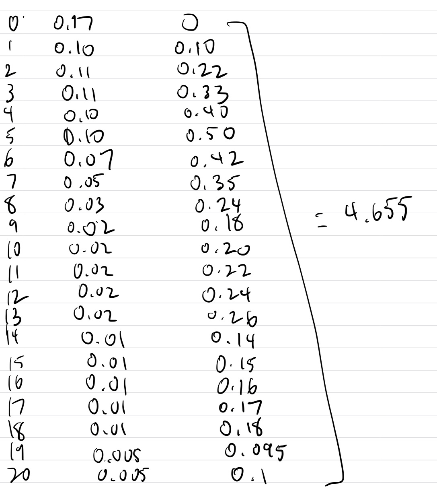
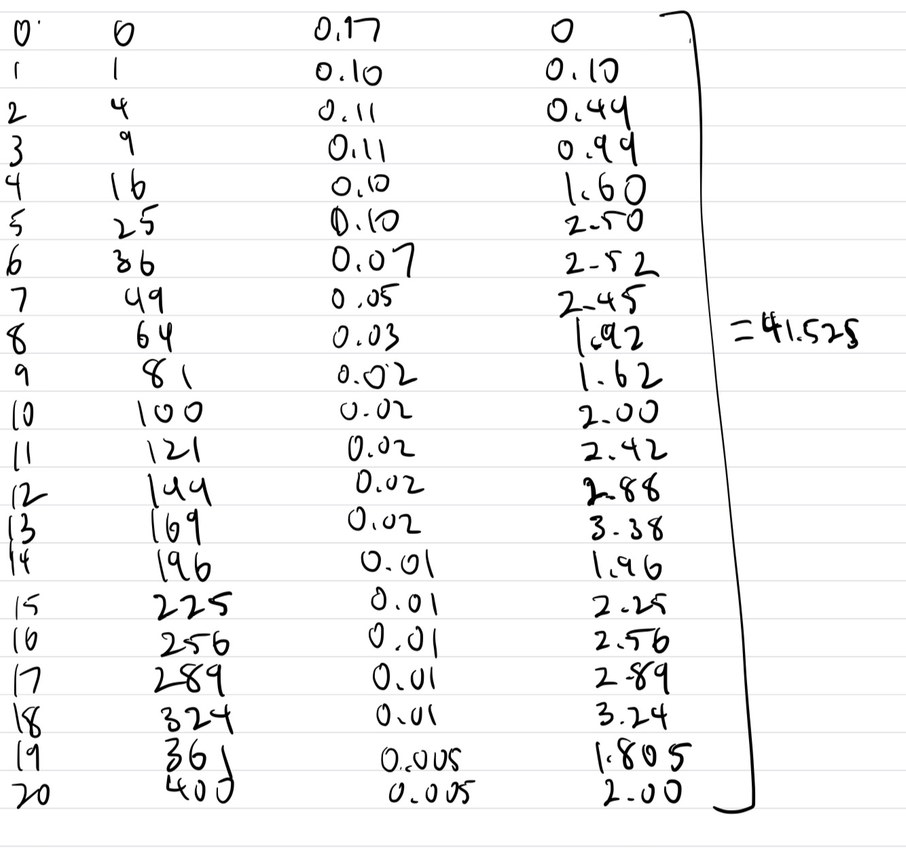

```{r setup, include=FALSE, fig.align='center'}
knitr::opts_chunk$set(echo = TRUE)
```

# Questions{5/17} Completed

## Q 1

a) P(expert fail) = 1 - P(expert success) = 7.88%

b) P(novice fail) = 1 - P(novice success) = 25.45%

c) The participant is more likely to be a novice.

## Q 2

a) P(Positive | User) = 50/100 = 0.5

b) P(Negative | Non-User) = (900-9)/900 = 0.99

c) P(User | Positive) = [P(Positive | User) * P(User)] / P(Positive)
   P(Positive) = P(Positive | User) * P(User) + P(Positive | Non-User) * P(Non-User) 
   = 0.5 * 0.1 + 0.01 * 0.9 = 0.05 + 0.009 = 0.059
   P(User | Positive) = [0.5 * 0.1] / 0.059 = 0.847

## Q 3

Multiplicative Rule Proof: 
To form a sample of $k$ elements, you have to take an element from each of the sets. For the first set, there are $n_1$ possible choices for the element because the first set contains $n_1$ elements. 
For second set, there are $n2$ choices. 
By the $k$th set, there $n_k$ choices. 
The principle of counting shows that the total number of different samples that can be formed is 
$$
n_1n_2...n_k
$$
where $n_1$ = choices for k=1 set, $n_2$ = choices for k=2 set, all the way to 
$n_k$ = choices for $k$th set.

## Q 4

Permutations Rule Proof: Given $n$ out of $N$ distinct elements in a distinct order, each time we choose an element there will be one less option.
Using the Multiplicative Rule, the permutations for $N$ becomes
$$
N(N-1)(N-2)(N-3)...(N-n+1)
$$
which is $N!$.
To keep the first $n$ elements we divide $N!$ by $(N-n)!$ which gives us the equation
$$
\frac{N!}{(N-n)!}
$$

## Q 5

Partitions Rule Proof: Let A = number of ways to partition $N$ distinctly different elements into $k$ sets. Using the Permutation Rule where $n = N$, it becomes 
$$
\frac{N!}{(N-N)!} = \frac{N!}{0!} = N!
$$
With the Multiplicative Rule
$$
N! = (A)(n_1!)(n_2!)(n_3!)...(n_k!)
$$
Then we divide $(n_1!)(n_2!)(n_3!)...(n_k!)$ from both sides to get
$$
A = \frac{N!}{(n_1!)(n_2!)(n_3!)...(n_k!)}
$$
where $n_1$ = elements in set 1, $n_2$ = elements in set 2, $n_3$ = elements in set 3, and $n_k$ = elements in set $k$.

## Q 6

Combinations Rule Proof: The Partitions Rule gives us the equation
$$
A = \frac{N!}{(n_1!)(n_2!)(n_3!)...(n_k!)}
$$
for dividing elements into k sets where $n_1!, n_2!, n_3!, ..., n_k!$ are representative of each set.
Selecting $n$ elements from $N$ elements gives us two sets.
Where one group is $n!$ and the other $(N-n)!$.
So the equation from the Partitions Rule becomes
$$
(\substack{N\\n}) = \frac{N!}{n!(N-n)!}
$$

## Q 7 

a) 0.09 + 0.30 + 0.37 + 0.20 + 0.04 = 1

b) P(3) + P(4) = 0.20 + 0.04 = 0.24

c) P(0) + P(1) = 0.09 + 0.30 = 0.39

## Q 8

a) Each p(y) is between 0 and 1.

   Total of P(y) = 0.17+0.10+(0.11 * 2)+(0.10 * 2)+0.07+0.05+0.03+(0.02 * 5) + 
   (0.01 * 5) + (0.005 * 2) = 1
   
b) P(Y>=10) = (0.02 * 4)+(0.01 * 5)+(0.005 * 2) = 0.14

c) Mean = $\mu = E(Y) = \sum y * p(y)$ = 4.655


   Variance = $\sigma^2 = E(Y^2) - E(Y)^2 = 41.525 - 4.655^2 = 19.856$
   
d) $\mu \pm 2 * \sigma = 4.655 \pm 2 * 4.456 = (-4.26, 13.56)$

   Since y >= 0 and y is a whole number, (-4.26, 13.56) becomes (0, 14).

## Q 9

a) 
P(Y=10)
```{r}
  dbinom(10, 25, 0.7)
```

b) 
P(Y<=5)
```{r}
  pbinom(5, 25, 0.7)
```

c)
```{r}
  mean = 25 * 0.7
  mean
  sd = sqrt(25 * 0.7 * (1-0.7))
  sd
```

d)

The mean of 17.5 says that about 17.5 students out of 25 engineering graduate students will be foreigners.

The standard deviation of 2.29 says that the actual results may vary between $\pm2.29$ around the mean.

## Q 10

a) $\frac{50!}{(5!)^{10}}(\frac{1}{10})^{50}$
```{r}
  (factorial(50)/(factorial(5)^10)) * (0.1)^50
```

b)
```{r}
  pbinom(1, 50, 0.1)
```

## Q 11

a) $P(Y=y) = p(1-p)^{y-1}$

b) $E(Y) = \frac{1}{p} = \frac{1}{0.12+0.06+0.04+0.018} = \frac{1}{0.40} = 2.5$

This means that on average, 2.5 customers must be interviewed until a customer indicates a reason for a product being a green is not part of the product's label or packaging.

c) $P(Y=1) = 0.4(0.6)^{1-1} = 0.4 * 1 = 0.4$

d) $P(Y>2) = 1 - P(1) - P(2) = 1 - 0.4 - (0.4 * 0.6) = 0.36$

## Q 12

a) 10 * (8/209) = 0.383

An average of 0.383 out of 10 

b) P(X = k) = (choose(K, k) * choose(N-K, n-k))/choose(N, n)

k = 4, K = 8, n = 10, N = 209
```{r}
choose(8, 4) * choose(201, 6) / choose(209, 10)
```

## Q 13

a) E(Y) = $\lambda$ = mean = variance = 0.03

b)
- Casualties are rare occurances <br>
- Casualty probability is constant <br>
- Casualties are independent of each other <br>

c) $P(y) = \frac{\lambda^ye^{-\lambda}}{y!}$

   $P(0) = \frac{\lambda^0e^{-\lambda}}{0!} = \lambda^0e^{-\lambda}$
   
   $\lambda^0e^{-\lambda} = 0.03^0e^{-0.03} = e^{-0.03}$
   
   $e^{-0.03}$ = 0.9704

## Q 14

a) $\int^1_0 c(2-y)dy = c\int^1_0 (2-y)dy = c\int^1_0 (2y-\frac{y^2}{2}) = 1$

   $c((2(1)-\frac{1^2}{2}) - (2(0)-\frac{(0)^2}{2})) = c(2-\frac{1}{2})$
   
   $c\frac{3}{2} = 1 \rightarrow c3 = 2 \rightarrow c = \frac{2}{3}$
   
   $c = \frac{2}{3}$
   
b) $\frac{2}{3}(2y-0.5y^2)$

c) $F(0.4) = \frac{2}{3}(2(0.4)-0.5(0.4)^2) = \frac{2}{3}(0.8-0.5(0.16))$
   $=\frac{2}{3}(0.8-0.08) = \frac{2}{3}(0.72) = 0.48$
   
d) $P(0.1 \le Y \le 0.6) = (\frac{2}{3}(2(0.6)-0.5(0.6)^2) - \frac{2}{3}(2(0.1)-0.5(0.1)^2))$

   $= \frac{2}{3}(1.2-0.18) - \frac{2}{3}(0.2-0.005) = 0.68 - 0.13 = 0.55$

## Q 15

a) $\mu = E(Y) = \int yf(y)dy = \int^5_{-5} y\frac{3}{500}(25-y^2)dy$

   $= \frac{3}{500}\int^5_{-5} 25y-y^3dy$
   
   $= \frac{3}{500}\int^5_{-5} \frac{25y^2}{2}-\frac{y^4}{4}$
   
   $= \frac{3}{500}((\frac{25(5)^2}{2}-\frac{(5)^4}{4}) - (\frac{25(-5)^2}{2}-\frac{(-5)^4}{4}))$
   
   $= \frac{3}{500}((\frac{625}{2}-\frac{625}{4}) - (\frac{625}{2}-\frac{625}{4}))$
   
   $= \frac{3}{500}0$
   
   $=0$
   
   $\sigma^2 = \int^5_{-5} y^2 \frac{3}{500}(25-y^2)dy$
   
   $= \frac{3}{500} \int^5_{-5} (25y^2-y^4)dy$
   
   $= \frac{3}{500} \int^5_{-5} (\frac{25y^3}{3}-\frac{y^5}{5})$
   
   $= \frac{3}{500}((\frac{25(5)^3}{3}-\frac{5^5}{5}) - (\frac{25(-5)^3}{3}-\frac{-5^5}{5}))$
   
   $= \frac{3}{500}((\frac{3125}{3}-\frac{3125}{5}) - (\frac{-3125}{3}+\frac{3125}{5}))$
   
   $= \frac{3}{500}(\frac{3125}{3}-\frac{3125}{5} + \frac{3125}{3}-\frac{3125}{5})$
   
   $= \frac{3}{500}(\frac{6250}{3}-1250)=\frac{3}{500} \frac{2500}{3}$
   
   $= \frac{2500}{500}$
   
   $= 5$
   
b) mean (hr) = 0/60 = 0

   variance (hr) = $\frac{5}{60} = \frac{1}{12}$
   
c) mean (sec) = 0 * 60 = 0

   variance (sec) = 5 * 60 = 300

## Q 16

a)
```{r}
  u = 50
  o = 3.2
  1 - pnorm(45,u,o)
```

b)
```{r}
  pnorm(55,u,o)
```

c)
```{r}
  pnorm(52,u,o) - pnorm(51,u,o)
```

## Q 17

a)
```{r}
  u17 = 605
  o17 = 185
  pnorm(700,u17,o17) - pnorm(500,u17,o17)
```

b)
```{r}
  pnorm(500,u17,o17) - pnorm(400,u17,o17)
```

c)
```{r}
  pnorm(850,u17,o17)
```

d)
```{r}
  1 - pnorm(1000,u17,o17)
```

e)
```{r}
  qnorm((1-0.1),u17,o17)
```

